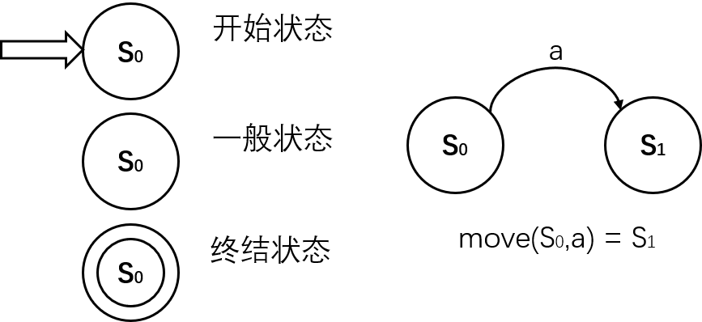
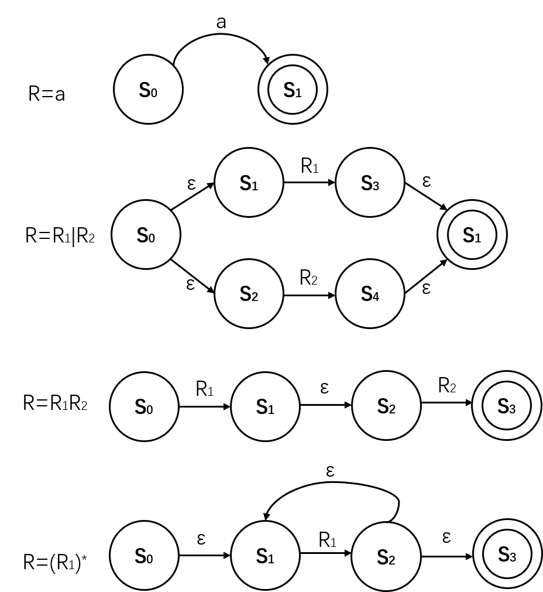
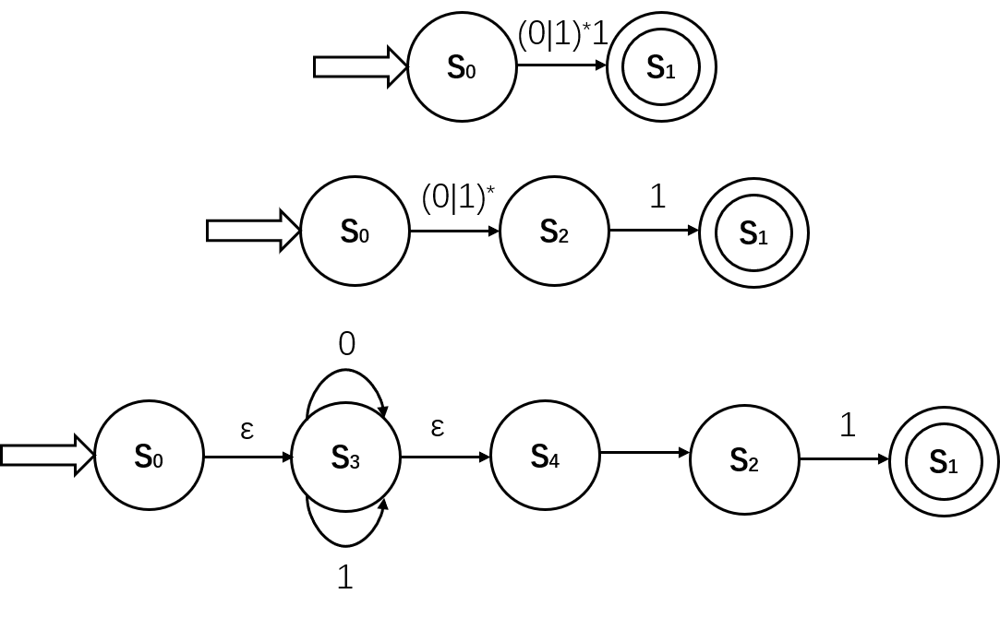

# 词法分析器的功能
1. 将字符流转换成记号流，提供给语法分析器使用
2. 去除源程序的注解、空白，如果源程序语言支持宏定义，词法分析器也可以负责将宏定义展开
3. 将编译器各个阶段的错误信息与源程序联系起来，由于词法记号流不存在行的概念，因此可以由词法分析器记住当前所处的行号，从而将错误信息对应的行位置确定

# 词法记号、模式、词法单元
## 词法记号
### 定义
token/词法记号号是一类符合相同模式的词法单元的统称，实际上记号包含记号名和属性，而前者是一类词法单元的抽象名字，后者是可选的(可以没有)<br>
即 token = <token_name,attribute_value>
### 词法记号的属性
用于在记号的二元组内记住记号的信息，从而翻译记号。某些记号可以没有属性值，因为其记号名足以指示如何翻译这个记号。  
例如下列代码中：
```
position = initial + 60*rate
```
记号二元组包括：<**id**,指向符号表中position条目的指针><**assign_op**><**id**,指向符号表中initial条目的指针><**add_op**><**number**,整数值60><**mul_op**><**id**,指向符号表中rate条目的指针>


记号名影响语法决策，而属性影响如何翻译
{:.notice--info}

## 模式
pattern/模式描述了某一记号的字符串的构成规则

## 词法单元
lexeme/词法单元(也称词素、单词)是词法记号的实例，即匹配某个记号模式的字符序列

## 三者关系举例
例如记号名叫做**id**，属于这一记号名的词法单元有sum,count这些变量名，而对这一类记号的模式的非形式化描述可以是：字母开头的字母数字串


# 正则表达式
## 串、语言
### 基本定义
- 字母表：符号的有限集合  
- 串：符号的有穷序列。字母表上的串即该字母表内符号组成的有限集合。  
- 语言：字母表上串的集合。某种语言的串又称作该语言的字或者句子。
### 语言的运算
- $L \cup M =\{ s \mid s\ \in L\ or\ s\ \in M \}$，即语言的并
- $LM = \{ st \mid s \in L\ and\ t \in M \}$，即语言的连接
- $L^* =\bigcup_{i=0}^{\infty}L^i$，即零个或多个L句子的连接的并
- $L^+ =\bigcup_{i=1}^{\infty}L^i$，即一个或多个L句子的连接的并


## 正规式
### 基本定义
一组定义规则，这组定义规则**描述了串的模式**，即串模式的形式化描述。每个正规式$r$代表了一种语言$L(r)$，说明了$L(r)$中的句子是如何由$r$构造的，正规式表示的语言叫做正规语言或**正规集**。  


区别正规式和句子：句子是串，而相应的正规式是描述这个串的模式的规则，例如某正规式r=a，那么$L(r) = {a}$，并且a是该语言的一个句子，虽然正规式和这里提到的这个句子都用a表示，但他们本质不同
{:.notice--info}

### 正规式包含的运算
若$r,s$都是正规式，那么它们的运算和对应关系如下  
- $r\mid s = L(r) \cup L(s)$，该运算称为**选择**
- $rs = L(r)L(s)$，该运算称为**连接**
- $r^* = L(r)^*$，该运算称为**闭包**
- $r^+ = L(r)^+$，该运算称为**正闭包**
- $r = s \iff L(r)=L(s)$，即两正规式等价等价于它们表示的语言相同

各算符均是**左结合**的，并且优先级闭包、正闭包相等，大于连接运算，大于选择运算

### 正规定义
正规定义指将正规式用名字进行命名，并在后续的定义中通过引用这些名字来引用正规式。一般形式为如下定义**序列**  
$name_1 \to r_1$  
$name_2 \to r_2$  
$...$  
$name_n \to r_n$  
其中$r_i \in \sum \cup \{ r_1,r_2,...,r_{i-1}\}$ 

注意：正规定义是不允许递归定义的，且正规定义只能引用**已经定义好**的正规定义。
{:.notice--info}


# 有限自动机
即识别器程序实现的逻辑模型，可以认为是正规式或者是模式的图形化，其可以用状态转换图或者状态转换矩阵(表格)来描述

## 基本概念
### 状态转换图表示

### 有限自动机识别的语言
$\alpha$是某FA**识别(接受)**的串 $\iff$ $\exists$一条从FA初态到某个终态的状态转换路径，该路径上所有标记的字符序列为$\alpha$  
FA识别(接受)的语言指的FA识别(接受)的串的集合，记为$L(M)$

## NFA
NFA(Non-deterministic Finite Automata)是一个数学模型$(\sum, S,s_0,F,move)$，该五元组的各部分意义如下：  
1. 一个有限的状态集合$S$
2. 唯一的初始状态$s_0 \in S$
3. 终止(接受)状态$F\subseteq S$
4. 输入符号集(输入字母表)$\sum$，要注意空串$\epsilon$是不会出现在输入字母表里的
5. 状态转移函数$move:S \times (\sum \cup \epsilon) \to P(S)$，其中$P(S)$是有限状态集合$S$的幂集（即所有子集）

## DFA
DFA是NFA的特殊情况，其与NFA的区别在于：  
1. 不存在$\epsilon$转化
2. 状态转移函数$move:S \times \sum \to S$，即为单值函数，任意状态通过某转化最多只能转移到一个状态  


NFA一般而言可以直接从正则式推出，其制作的识别器要慢于DFA，但是其状态数相对DFA更少，因此所使用的存储空间更小
{.:notice--info}


## 正则式与NFA或DFA
$\sum$ 上的NFA $\iff \sum$ 上的正规式R，即对$\sum$上的NFA，**一定存在一个NFA**，使得$L(R)=L(M)$，反之亦然。  
另外，由于NFA一定可以化为DFA，因此实际上$R,NFA,DFA$是等价的(不能认为是一一对应的，因为状态机可以有多种形式)，后两者识别语言的能力是**相同**的，但是**效率不同**

### Tompson方法
即将正则式转化到NFA的一套固定对应关系。这种方法是**自底向上，从左到右**的，并且是递归的，对应关系如下图  
  

注：上面$R  = (R1)^*$应该在$S_0,S_3$之间加一个从前者者到后者的**空转换**，因为**闭包包括空串**。

例如图中对于连接运算生成相应NFA，并递归地调用对其中$R_1,R_2$转换的生成过程，最终递归结束时是由最内层递归不断向上一层返回的。

### 简化方法
可以对正规式**自顶向下**进行**分解**，即先将整个正规式作为一个整体转化，然后将最外层转换分离单独作为一个转换，因此可以采用循环的结构(或者尾递归)，自顶向下进行  
例如对正规式$(0|1)^*1$的自顶向下构造如下图  
  

## NFA到DFA的转化
NFA到DFA的方法称为**子集构造法**。  
核心思想：将NFA中**状态集合的子集**组成新的状态作为DFA中的状态，这些状态是上一新状态中原状态通过同一转化得到的，它们和它们任意次空转换得到的状态合在一起得到一个新状态，最终各状态之间的转移符合DFA定义(即无空转换并且转换函数为单值)  。

### 算法描述
输入：一个NFA  
输出：一个DFA，并且其和输入的NFA接受相同的语言  
算法：   
while(there exists unsigned state T in Newstates[])  
&emsp;   for each input sign a  
&emsp;&emsp;D = $\epsilon-closure$(move(T,a))  
&emsp;&emsp;if(D not in Newstates[]) Add D into Newstates[]  
&emsp;&emsp;newmove[T,a] = D  

具体例子可参考《编译原理》p44例子


## DFA化简
每一个正规集都可以由一个**状态最少(最简)**的DFA识别，并且这个DFA是唯一的(证略)  
核心思想：从粗粒度到细粒度对状态集合进行划分，划分的依据是能否**区分**同一集合内的状态，两个状态能**区分**指以下含义：  
1. 接受状态和非接受状态是一定可以区分的(初始时即可划分在两个集合内)
2. 如果两个状态通过$\sum$上任意转化到达的集合是彼此相同的，那至少当前这两个状态无法被区分，它们仍旧处于同一集合

### 算法描述
输入：一个DFA M 
输出：一个DFA M'，其和M接受相同的语言并且状态数最少  
算法：  
1. 初始划分$\Pi$：添加死状态(指可以从初始状态到达但是一旦到达就无法前往接受状态的状态)把转换函数变为全函数，将M的状态划分成接受子集$F$和非接受子集$S$。
2. for each set G in $\Pi$  
&emsp;state s,t are remains together **if and only if** for each input sign a, move(s,a),move(t,a) are in same set  
&emsp;&emsp;if($\Pi == \Pi_{new}$) break  
&emsp;$\Pi = \Pi_{new}$
1. 将包含M初始状态的集合作为新的初始状态，将包含M接受状态的集合作为新的接受状态，并去除死状态和无法通过初始状态到达的状态(指原来的状态的集合构成的新状态)，构造M'  
   

最终得到的新状态集合一定满足要么只含原来的接受状态，要么不含原来的接受状态。


Q：为什么化简之前要利用死状态将转换函数变为全函数？如果不是全函数为什么化简之后DFA可能接受不同的语言？

