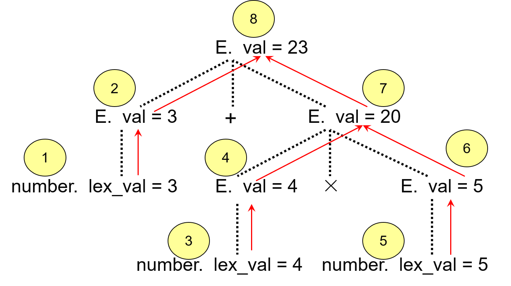
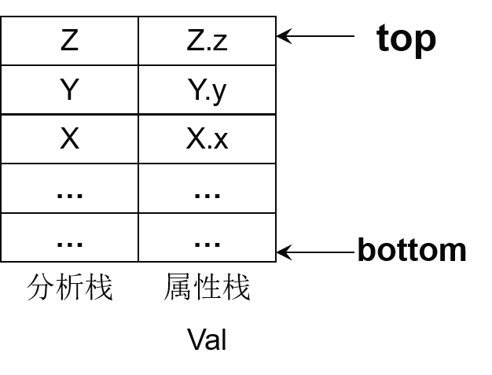
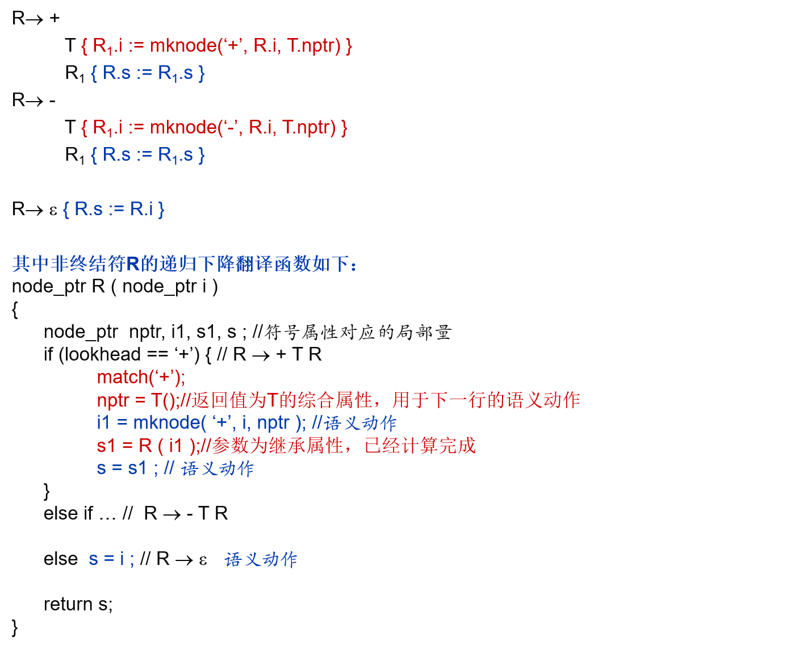
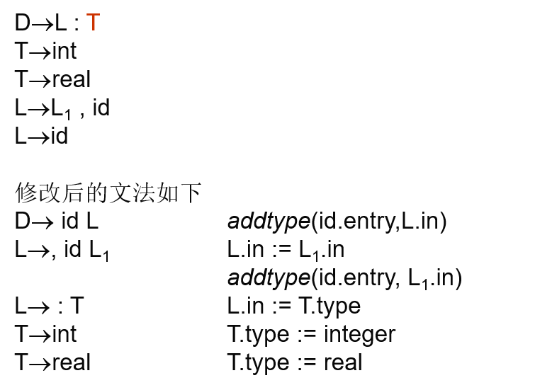

# 1.语法制导定义

## 1.1.基本概念

- **属性**：用来描述文法符号的语义特征，例如常量的“值”(value)等。
- **语义规则**：即属性计算规则，反映了产生式中文法符号属性之间的关系。

## 1.2.语法制导定义

### 1.2.1.基本定义

语法制导定义是指**带有属性和语义规则的上下文无关文法**。

### 1.2.2.对比

和语法制导定义相似的概念有：**属性文法**、**翻译方案**。

- 属性文法：指语义动作没有副作用(例如输出一个值，创建一个节点，修改全程量等)的语法制导定义，是一种特殊的语义制导定义。
- 翻译方案：更为详细的语法制导定义，即将语义规则换成语义动作，指明了语义规则执行的时机。

### 1.2.3.语法制导定义形式

在一个语法制导定义中，包含以下几部分内容：

- 文法符号拥有一组属性
- 产生式拥有一组语义规则，形式为 $b = f(c_1,c_2,...,c_k)$或者是过程调用、程序段，其中$b,c_1,...,c_k$均为文法符号的属性，并且该规则定义了属性$b$。

#### 1.2.3.1.属性分类

语法制导定义中文法符号的属性$b = f(c_1,...,c_k)$可以分为两类：  

- 若$c_1,...,c_k$均为产生式右部符号的属性或左部的其他属性，$b$为产生式左部符号的属性，那么称$b$为对应文法符号的**综合属性(synthesized attribute)**。
- 若$c_1,...,c_k$为产生式右部和左部符号的属性，$b$为产生式右部符号的属性，那么称$b$为对应文法符号的**继承属性(inherent attribute)**。  

终结符只有综合属性，也称固有属性，由词法程序提供。{:.notice--info}

### 1.2.4.语法制导定义分类

#### S属性定义

​	**S属性定义**指仅使用综合属性的语法制导定义。

#### L属性定义

​	**L属性定义**指对于每个产生式$A \rightarrow X_1...X_n$的语义规则，只计算：

1. $A$的综合属性
2. $X_i$的继承属性，并且该属性仅依赖于产生式中$X_j$左边的符号$X_k(k \lt j)$的属性以及$A$的继承属性。

注：S属性定义均为L属性定义，因为L属性定义只对继承属性计算做了限定。{:.notice--info}

### 1.2.5.语义规则计算方法

#### 分析树方法

##### 分析树与依赖图

- **分析树**即以产生式左部为根，产生式右部为孩子构成的树。每个节点的每个属性都标注出来的分析树叫做注释分析树。

- **语法树**即浓缩的分析树，其将算符以及关键字作为根节点。

- **依赖图**基于分析树，在分析树中每个节点的每个属性都在依赖图中有一个节点(如果只有一个属性，可以直接用注释分析树代替分析树，无需增加属性节点)，并且属性节点之间使用有向边表示依赖关系，其中产生副作用的语义规则使用虚拟节点(用一个数字)表示，并且如果有依赖关系也要标出。

注：语法制导翻译可以基于分析树，也可以基于语法树，方法一样。{:.notice--info}

例：下图为$3+4 \times 5$的属性依赖图，由于只有val一个属性，直接用属性节点表示文法符号。

更多例子参考《编译原理》p113。

##### 方法描述

- 建立分析树
- 基于分析树建立属性依赖图，若有依赖环则失败
- 对依赖图进行拓扑排序，得到属性计算的次序
- 按照排序结果计算属性，从而实现翻译

##### 优点/缺点

分析树方法的缺点有：

- 由于属性计算次序是在编译时通过生成依赖图得到的，因此编译速度变慢。其他的一些方法编译前就确定属性计算次序，从而提高编译速度。

#### 基于规则的方法

##### 方法描述

基于规则的方法重点在于**手工**找出各产生式的语义规则计算顺序，然后由此构造编译器，按照手工确定的次序来进行翻译。

##### 优点/缺点

优点：

- 不必显式构造依赖图等，因此编译效率有提升。

缺点：

- 有一些复杂的语法制导定义难以手工确认计算顺序。

#### 忽略规则的方法

##### 方法描述

忽略规则的方法重点在于其**不是**依据语义规则的特点来确定计算次序，而是要求编译器设计者按照**自动生成工具(例如Yacc)所要求**的语义规则形式来提供语义规则，否则自动生成器无法正确计算属性。

# 2.自底向上翻译

自底向上或自下而上翻译主要针对S属性定义，这是由S属性的定义的特点决定的。可以借助自下而上的分析器在分析的同时完成属性计算。

## 2.1.拓广分析栈

拓广分析栈即在一般的分析栈旁加上属性栈存放对应文法符号的综合属性形成的栈。由于右部文法符号的属性和栈内位置对应，可以在**归约前先计算归约后左部符号的综合属性，然后再归约**。

例如：$A \rightarrow XYZ \{ A.a = f(X.x+Y.y+Z.z) \}$，其中$a$是$A$的综合属性。

如下图分析栈和属性栈所示，栈顶为$top$，那么$X.x,Y.y,Z.z$位于$top-2,top-1,top$。归约后新栈顶$ntop$存放$X.x$，其位置为$top - 2|handle\ length|+1$(因为分析栈包含状态和文法符号)。语义动作的属性栈代码可以对应属性栈中属性位置来写，ntop位置根据句柄长度来确定，可以直接用计算后的值替换ntop。

属性栈上**只允许存放综合属性**，如果涉及到继承属性，例如L.in，这个时候可以直接去栈上找L.in的来源，直接使用。（如果可以预知来源在栈上的位置时，即位置固定时）

位置不固定时，修改文法，插入一个新的非终结符M（其只有一个空产生式），从而把源头的属性搬运到M的综合属性，放在属性栈上我们指定的位置。

注：为什么$A \rightarrow \alpha \{A.a = \alpha .a\}$的文法动作可以省略？因为计算属性并弹出句柄后，$A$的属性正好位于$\alpha$属性原来的位置，只需修改栈顶，无需指明文法动作。(拷贝规则){:.notice--info}

## 2.2.L属性定义的自底向上翻译

L属性同样可以进行自底向上翻译

# 3.自顶向下翻译

自顶向下分析主要针对L属性定义，这是由L属性定义的特点决定的。可以借助自上而下的预测分析器在分析的同时完成属性计算。

## 3.1.修改递归下降函数

​	通过对递归下降分析函数进行一定的修改，即可使得能进行预测分析的文法在分析的同时完成L属性定义的属性计算。  

​	要注意的是，如果要采用递归下降预测分析，那么基础文法需要满足可预测分析文法需要满足的条件，例如提左因子消除二义性、无左递归等，LL(1)文法是一个例子。

### 递归函数形式

- 参数：对应文法符号(非终结符)的**继承属性**，这个继承属性来自左部综合属性以及右部当前符号左边符号的属性，在父函数的函数体内完成计算。
- 函数体：按照当前符号预测产生式，并且按照预测的产生式右部文法符号以及语义动作的顺序依次调用递归函数以及计算对应属性放入局部量，具体来说，包括：
  1. 计算指计算接下来要分析的非终结符的继承属性作为其递归参数。
  2. 递归调用函数，参数为计算得到的存放继承属性的局部变量，用局部变量存储返回值(综合属性)。
  3. 对终结符进行match，如果终结符有属性，则用局部变量存储属性。
- 返回值：返回值为当前文法符号的综合属性，因为后续可能需要用到或者需要记录下来

注：能否在分析同时完成属性计算的关键在于能否设计翻译方案，**使得信息流在语法树上从左向右流动**，因为无论是自上而下还是自下而上分析，语法树永远是从左向右建立的。

# 4.一些常见问题

## 4.1.只能得到非L属性定义

​	某些文法由于信息流从右向左流动，无法获得L属性定义，这个时候需要修改文法。

​	例如Pascal语言变量声明，其文法如下，由于L中所有id的type必须来自T，然而当L归约完成时，T还没有开始分析，无法分析的同时填写符号表中id的类型。  

​	修改思路为：**将文法改为右递归的，让分析树不断生长，直到看到类型后再逐层归约，归约时即可自下而上填表**。

## 4.2.避免使用继承属性

​	有些时候，不允许使用继承属性，需要修改文法使其能使用S属性定义翻译。

# 5.翻译方案设计的原则

翻译方案最重要的设计原则是：**保证语义动作所引用的属性值是可用的。**具体可以按照以下原则：

- 对于S属性定义，由于只涉及到综合属性，因此动作放在产生式末尾即可。
- 如果涉及到继承属性，那么按照以下原则：
  1. 右部符号的继承属性必须在开始分析此符号前计算，这是因为分析时可能要用到继承属性，需要提前计算好从而使用。通常**语义动作放在对应符号前面即可。**
  2. 语义动作不要引用其右边符号的综合属性(即不能存在**右依赖**)，如果引用右边符号的继承属性，那么要注意要提前计算从而让当前动作能使用。
  3. 左部非终结符的综合属性一般**放在产生式末尾即可**，从而保证右部符号全部分析完，属性计算完成，左部符号综合属性引用的属性均可用。
