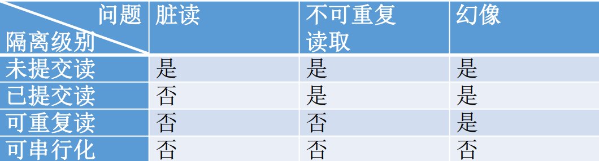
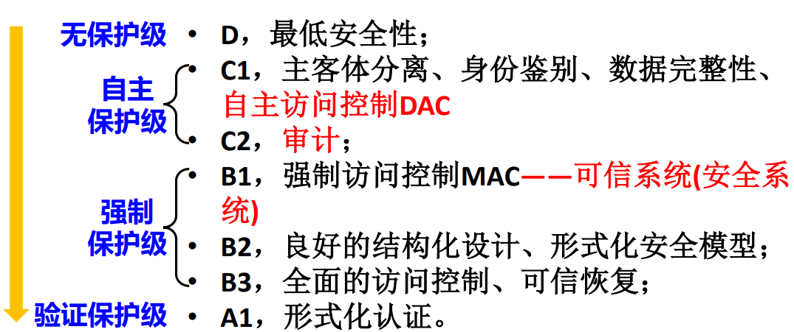

This file includes the outline of database course of USTC.

# DBS概论

- 数据库与文件系统对比
- DBS基本概念：数据、数据模型、数据库模式、数据库、DBS、DBMS
- DBMS的概念和功能
- DBS构造步骤（六个步骤）：需求分析、概念设计、逻辑设计、物理设计、数据库实施、数据库运维

# DBS体系结构

- DBS体系结构
  - 集中式DBS
    - 查询的并行：粗粒度并行（每个处理器处理一个查询）和细粒度并行（单个查询被划分到多个处理器运行）
  - C/S
    - 两层体系结构
    - 三层体系结构
  - B/S
    - 三层体系结构
  - 并行DBS
    - 由通过快速互联网络连接的多个处理器和多个磁盘组成
    - 加速比、扩展比
    - 启动成本、干扰、偏斜
  - 分布式DBS
    - 特点：物理分布、逻辑统一
    - 局部自治
    - 共享数据，全局应用
- DBS模式结构
  - 模式：数据库中全体数据的逻辑结构和特征的描述
  - 实例：模式的具体值
  - ANSI/SPARC体系结构（三级模式结构+两级映像）
    - 三级模式
      - 内模式：数据物理结构和存储方式的描述（例如记录是按顺序存储、B树存储、散列存储？）
        - 一个数据库只有一个内模式。不涉及物理块（或页）的大小， 也不考虑具体设备的柱面或磁道大小
        - 内部视图：内模式的实例
        - 通过内模式DDL定义
      - 概念模式：（模式、逻辑模式）数据库中全体数据的逻辑结构和特征的描述
        - 一个数据库只有一个概念模式，不涉及数据物理存储的细节和硬件环境
        - 概念视图：概念模式的实例
        - 通过模式DDL定义
      - 外模式：单个用户所看到的局部数据的逻辑结构和特征的描述
        - 建立在概念模式之上，同一模式上可有 多个不同的外模式；对用户而言，外模式就是数据库
        -  外部视图：外模式的实例
        - 通过外模式DDL定义
    - 两级映像
      - 外模式/模式映像：数据的逻辑独立性
      - 模式/内模式映像：数据的物理独立性

# 关系数据模型

- 数据模型
  - 定义：描述现实世界实体、实体间联系以及数据语义和一致性约束 的模型
  - 层次：
    - 概念数据模型（概念模型）
    - 逻辑数据模型（数据模型）
    - 物理数据模型（物理模型）
  - 类型
  - 三要素
    - 数据结构
    - 数据操作
    - 数据完整性约束
- 关系模型
  - 基本定义：用二维表格结构表示实体集，外码表示实体间联系，三类完整性规则表示数据约束的数据模型
    - 数据结构：关系
    - 数据操作：关系运算
    - 完整性约束：三类完整性约束
  - 术语和概念：属性、度、域、元组、势、关系、关系模型、关系模式关系数据库模式、关系数据库
  - 关系模式的形式化定义： $R(U,D,dom,F)$ 
  - 超码、候选码和主码
    - 超码
    - 候选码
      - 主属性
      - 非主属性
    - 主码
    - 替换码
  - 关系的性质（关系是元组的**集合**）
    - 属性值不可分解：不允许表中有表 
    - 元组不可重复：一个关系模式至少存在一个候选码 
    - 没有行序，即元组之间无序，关系是元组的集合 
    - 没有列序，即属性之间无序 ，关系模式是属性的集合
  - 关系模型三类完整性规则
    - 实体完整性(Entity Integrity) ：组成主码的所有属性均不可取空值
    - 参照完整性(Referential Integrity) ：参照关系R的任一个外码值必须 • 等于被参照关系S中所参照的候选码的某个值 • 或者为空
    - 用户自定义完整性(User-Defined Integrity)：针对某一具体数据的约束条件，反映某一具体应用所 涉及的数据必须满足的特殊语义
  - 关系代数（TODO: ppt上例子复习）
    - 性质：封闭性
    - 传统的集合操作（4个） 
      - 并(Union), ∪：返回两个关系中所有元组
      - 交(Intersection), ∩：返回两个关系的所有共同元组 
      - 差(Difference), −：返回属于第一个关系但不属于第二个关系的元组 
      - 笛卡儿积(Cartesian Product), ×：返回两个关系的元组的任意组合所得到的元组集 
    - 专门的关系操作（4个） 
      - 选择(Select), $\sigma$：返回指定关系中满足给定条件的元组 
      - 投影(Project), $\pi$：返回指定关系中去掉若干属性后所得的元组
      - 连接(Join)：从两个关系的笛卡儿积中选取属性间满足给定条件的元组
        - 自然连接, $\Join$
        - $\Theta$连接：在笛卡尔积𝑅 × 𝑆中选取𝑅的某属性值与𝑆的某属性值满足比较关系𝜃的元组
        - 等值连接：$\Theta$连接中比较关系为等号
      - 除(Divide), $\div$：除的结果与第二个关系的笛卡儿积包含在第一个关系中
    - 补充
      - 重命名：对运算结果重命名或者对已有关系的属性重命名，方便进行引用以及连接运算
    - 附加的关系代数操作（5个） 
      - 扩展投影（广义投影，extended project）：投影的拓展版本，投影列表可以是属性的表达式，例如数学表达式、字符串表达式、重命名等
      - 聚集函数 （aggregate）：输入一个值的集合，返回一个单一值
      - 分组 （group）, $\gamma_L(R)$：𝐿中只能包括两类对象 
        - 分组属性： γ操作依据某个属性的值将𝑅 分组。 这个用来分组的属性被称为分组属性 
        - 聚集函数：应用到某个属性上的聚集操作。这 个用作聚集操作参数的属性被称作聚集属性
      - 排序 （sort）,$\tau_L(R)$ 
      - 赋值 （assignment）$R \leftarrow E$：把关系代数表达式𝐸的结果赋给临时关系R
    - 数据更新
      - 插入（insert）, $R \leftarrow R ∪ S$
      - 删除（delete）, $R \leftarrow R - E$，E可以是关系代数表达式
      - 修改, $R \leftarrow \pi_{F1,F2,...,Fn}(R)$：通过广义投影修改某关系
        - 修改部分元组而不是全部的元组？$R \leftarrow \pi(R-S) \cup S$

# SQL

- 数据库语言概览：DDL, DML, DCL
- SQL术语
- SQL三级体系结构
- 基本表创建
  - 四种约束：主键约束、唯一性约束、外键约束、检查约束

# 过程化SQL

# 关系数据模式设计

# 数据库设计

# 数据库索引

# 数据库应用开发

- 数据库应用系统体系结构（商业服务层位置）
  - C/S
    - 以前端为主的两层式结构 
    - 以后端为主的两层式结构 
    - 三层式处理结构 
  - B/S
    - 分类
      - 三层Internet处理结构 
      - 多层Internet处理结构 
    - 通用网关接口（Common Gateway Interface，CGI）：一个标准，定义了Web服务器如何与应用程序进行通信。例如Java服务器端程序（Java Servlet）规范。
    - 应用程序：通过ODBC，JDBC或其他协议与数据库服务器通信。
  - 混合结构
-  数据库应用系统开发过程
  - 可行性研究
  - 需求分析
  - 设计
  - 编码
  - 测试
  - 运维
- 数据库访问方法：应用程序通过ODBC，JDBC或其他协议与数据库服务器通信。应用程序宿主语言访问数据库的API。
  - 分类
    - ODBC
    - JDBC：与Java绑定
    - ADO
  - 数据库应用典型结构
  - 数据库应用基本操作
    - 界面和功能围绕数据库中数据操作进行设计 ：数据的增加功能 ，数据的修改功能，数据的删除功能 ，数据的查询功能
  - 数据库应用编程过程
    - 数据管理界面设计：增、删、改、查界面设计，由于查询是数据库应用中最常用的功能， 因此界面往往以查询界面为主展开设计 
    - 数据管理功能的编程实现：SQL是应用与数据库的唯一接口，一般通过高层的编程接口如ADO实现数据库操作

# 事务

- 事务的概念
  - 事务(transaction)是一个操作序列，该操作序列： • 构成单一的逻辑工作单元 • 访问并可能更新各种数据项 • 不可分割，即序列中的操作“要么都做，要么都不做”
  - 事务模型：Input(X)/Output(X) 和 Read(X,t)/Write(X,t)(隐含input), Transaction Work Space&Memory Buffer&Disk
  - 事务的性质：ACID, atomic consistent isolated durable
- 事务的原子性
  - 含义：commit, aborted, roll back
  - 事务状态图：active, partially committed, committed, failed, aborted
  - 中止事务处理：重启（外部原因导致）/杀死（事务本身有问题）
  - 可见的外部写：解决方案、补偿事务
- 事务的一致性
  - 数据库的一致性：数据库在事务内部时并不处于一致性状态
  - 事务的一致性：事务的执行保证数据库从一个一致状态转到另一个一致状态，但事务内部不保证数据库处于一致性状态
  - 数据库的一致性、数据库的正确性、现实世界的正确性：前两者等价，一般不用现实世界的正确性来表示数据库的正确性
  - 单个事务的一致性和多个事务的一致性：前者由程序员保证，后者还需要事务的隔离性
- 事务的隔离性
  - 并发的意义
  - 事务并发带来的问题：单个事务的一致性和原子性，不能保证多个事务并发时数据库 的一致性
  - 什么样的调度能保持事务隔离性
    - 串行调度：可以保证事务的隔离性
    - 可串化调度
      - 冲突操作、冲突可串化
      - 冲突可串化 $\Rightarrow$ 可串化调度
      - 优先图
  - 保持事务隔离性的方法：并发控制机制
- 事务的隔离性和原子性：考虑事务之间的依赖关系，如果某个被依赖的事务失效会发生什么
  - 可恢复调度：如果被依赖事务的commit都出现在依赖事务commit之前
    - 可恢复调度不能避免级联回滚
  - 无级联调度：被依赖事务的commit出现在依赖事务相应的读操作之前
    - 无级联调度都是可恢复的
- 隔离性的级别 
  - 可串行化：保证按可串行化调度来执行。
  - 可重复读：只允许读已提交的数据并且 一个事务两次读取同一个数据项期间， 其他事务不得更新该数据项。
  - 已提交读：只允许读取已提交的数据。 
  - 未提交读：允许读未提交的数据。
- 事务的持久性
  - 一旦事务成功完成，该事务对数据库所做的所有更新都是持 久的，即使系统出现故障
- 语言对事务的支持
  - SQL：事务编程语句，start transaction, commit, rollback

# 并发控制

- 并发操作与并发问题
  - 三大并发问题： 丢失更新问题、 脏读、不一致分析 
- 并发控制机制
  - 基于锁的协议 
    - 锁操作
    - 锁协议(protocol): 使用锁的规则，well-formed和legal
    - 锁的互斥性和授予
    - 锁释放时机：过早释放可能会导致不一致
    - 两阶段锁（2PL）
      - 增长阶段（growing phase）：事务可以获得锁，但不能释放锁 
      - 缩减阶段（shrinking phase）：事务可以释放锁，但不能获得锁
      - 如果一个调度S中的所有事务都是两段式事务，则该调度是 可串化调度
    - 不同模式的锁
      - X lock（写锁）：互斥
      - S lock（读锁）：共享
        - S lock升级、可能的死锁问题
      - Update Lock：之后可能会升级成X锁，解决单纯的S lock升级引发的死锁
      - S/X-lock-based 2PL 
        - 事务在读取数据𝑅前必须先获得𝑆锁 
        - 事务在更新数据𝑅前必须要获得𝑋锁。如果该事务已具有𝑅上的𝑆锁，则必须将𝑆锁升级为𝑋锁 
        - 如果事务对锁的请求因为与其它事务已具有的锁不相容而 被拒绝，则事务进入等待状态，直到其它事务释放锁。
        - 一旦释放一个锁，就不再请求任何锁。（即2PL）
      - 相容性矩阵：
        - X/S/U Lock之间的相容性
        - 如果两个锁不相容，则后提出锁请求的事务必须等待
      - 多粒度锁（MGL）
        - 多粒度锁作用
        - 锁粒度概念、与并发度的关系
        - 多粒度树：小粒度数据项嵌套在大粒度数据项内
        - 多粒度锁协议
          - 树中的每个结点可以单独加锁，S锁或X锁 
          - 对某个结点加锁意味着其下层结点也被加了同类型的锁
        - 显式加锁和隐式加锁
          - 显式加锁：应事务的请求直接加到数据对象上的锁
            - 显示加锁需要考虑的情况
              - 该结点是否已有不相容锁存在 
              - 上层结点是否已有不相容的的锁（上层结点导致的隐式锁冲突） 
              - 所有下层结点中是否存在不相容的显式锁
          - 隐式加锁：本身没有被显式加锁，但因为其上层结点加了锁 而使数据对象被加锁
          - 意向锁：显示加锁需要判断情况太多
            - 对某结点显式加锁，则该结点的祖先均要加上意向锁
            - 分类
              - IS锁（Intent Share Lock，意向共享锁，意向读锁）
              - IX锁（Intent Exlusive Lock，意向排他锁，意向写锁）
            - IS/IX/S/X的相容性矩阵
        - 事务的隔离级别及其实现：许多事务并不总是要求完全的隔离。如果允许降 低隔离级别，则可以提高并发性
          - 隔离级别是针对连接（会话）而设置的，不是针对 一个事务 。不同隔离级别影响读操作。X锁必须保持到事务结束。不同隔离级别下DBMS加锁的动作有很大的差别。
          - 
          - 未提交读：事务不必等待任何锁，也不对读取的数据加锁
          - 已提交读：事务必须在所访问数据上加S锁，数据一旦读出， 就马上释放持有的S锁
          - 可重复读：事务必须在所访问数据上加S锁，而且S锁必须保持 到事务结束
          - 可串行化：事务必须在所访问数据上加S锁，而且S锁必须保持到事务结束；事务还必须锁住访问的整个表
      - 死锁
        - 定义：循环等待
        - 死锁的两种处理策略
          - 死锁预防
            - 保证发出的请求不会导致循环等待
              - 一次性申请所有锁：在事务开始执行前获得所有锁
              - 按顺序加锁：把要加锁的数据库元素按某种顺序排序，务只能按照元素顺序申请锁
            - 基于Timestamp使用抢占和事务回滚
              - 等待-死亡（Wait-Die Scheme）：一种非抢占技术
              - 伤害-等待（Wound-Wait Scheme）：一种抢占技术
              - 两种技术时间戳均不变
          - 基于锁超时（lock-timeout）机制：申请锁的事务最多等待一段指定的时间
            - 介于死锁预防和死锁检测与恢复之间的一种方法
            - 问题：时间设定、可能产生饿死
          - 死锁检测和恢复
            - 信息维护：所有数据项上的分配信息 ，所有悬而未决的数据项请求信息
            - 死锁检测：等待图
            - 死锁恢复：选择牺牲者、回滚、避免饿死
  - 基于时间戳的协议
    - 对于系统中的任一事务𝑇𝑖，𝑇𝑆(𝑇𝑖)​ ：事务𝑇𝑖的时间戳，唯一且固定
    - 基于事务的时间戳来决定可串化次序 
      -  等价的串行调度为： • 若𝑇𝑆(𝑇𝑖) < 𝑇𝑆(𝑇𝑗) ，则𝑇𝑖先于𝑇𝑗执行
    - 数据项上的时间戳
      - 成功执行write(A)的所有事务中的最大时间戳
      - 成功执行read(A)的所有事务中的最大时间戳
      - 每当有新的read(A)或write(A)操作时，同时更新相应的时间 戳
    - 时间戳排序协议：保证任何有冲突的read和write操作 按时间戳的次序执行
      - 事务𝑇𝑖发出read(A)
      - 事务𝑇𝑖发出write(A)
      - 若𝑇𝑖回滚，重启时，赋予新的时间戳
    - 问题
      - 保证没有死锁 ：按照时间戳协议，没有事务会等待，因此不会死锁 
      - 可能会饿死 ：可能导致事务反复重启 ，不利于长事务 
      - 可能会产生不可恢复调度 
      - 若时间戳协议只应用于元组，可能会产生幻像问题
  - 乐观并发控制
    - 乐观并发控制假定不太可能（但不是不可能）在多个用户间发生资 源冲突，允许不锁定任何资源而执行事务。如果发生冲突，则通过回滚某个冲突事务加以解决。
    - 有效性检查协议
      - 事务生命周期按三个阶段顺序执行
        - 读阶段
        - 有效性检查阶段
        - 写阶段
      - 三个时间戳
        - start
        - validation
        - finish
      - 有效性检查
        - 𝑇𝑆(𝑇𝑖) = 𝑉𝑎𝑙𝑖𝑑𝑎𝑡𝑖𝑜𝑛(𝑇𝑖)
        - 满足两个条件之一（𝑇𝑆(𝑇𝑘) < 𝑇𝑆(𝑇𝑖)，等价串行调度为k,i）
          - 无交错：𝑇𝑆(𝑇𝑖) = 𝑉𝑎𝑙𝑖𝑑𝑎𝑡𝑖𝑜𝑛(𝑇𝑖) 
          - 𝑻𝒌的写集与𝑻𝒊的读集不相交：𝑆𝑡𝑎𝑟𝑡𝑇𝑆(𝑇𝑖) < 𝐹𝑖𝑛𝑖𝑠ℎ𝑇𝑆(𝑇𝑘) < 𝑉𝑎𝑙𝑖𝑑𝑎𝑡𝑖𝑜𝑛(𝑇𝑖)，此时保证i读阶段在k写阶段之后完成，无级联回滚

# 事务与恢复

- 故障分类

  - 事务故障 
    - 可预期的
    - 不可预期的
  - 系统故障：软故障（Soft Crash）
    - 故障-停止假设（fail-stop assumption）
  - 介质故障：硬故障（Hard Crash） 

- DBS故障恢复策略

- 存储器分类

- 基于日志的恢复

  - 日志中事务的状态
  - 先写日志(Write-Ahead Log，WAL)原则
  - 事务对数据库的修改
    - 立即更新
    - 延迟更新
  - Undo日志
    - 内容
    - 规则：<T,x,old_value>，先写日志，立即更新
    - 恢复算法：没有commit的事务从后往前恢复到旧值，状态设置为abort
  - Redo日志
    - 内容
    - 规则：<T,x,new_value>，先写日志，延迟更新
    - 恢复算法：有commit的事务从前往后重做为新值，其他事务状态设置为abort
  - Undo/Redo日志
    - 内容：新值+旧值
    - 规则：可以立即更新或者延迟更新
    - 恢复算法：正向扫描，commit放入redo，其他放入undo；反向undo，正向redo，undo的事务状态设置为aborted

- 检查点

  - 检查点解决的问题
    - 搜索过程太耗时，因为日志文件增长很快
    - 最后产生的REDO列表很大，使恢复过程变得很长
  - 检查点技术保证检查点之前的所有事务操作的结果已写回数据库，在恢复时不需REDO
  - 由于恢复只需要使用检查点之后的日志记录，检查点之前的 日志记录可以被数据库清掉并回收这些记录所占用的空间

  

# 数据库安全

- 数据库安全安全性概述
  - 非法访问数据库情况
    - 推理分析
    - 直接或编写应用程序执行非授权操作
    - 编写合法程序绕过DBMS及其授权机制，例如SQL注入，将字符串判断条件更改或注释掉
  - 安全控制层次：用户、DBMS、OS、DB
  - 常用方法：
    - 用户标识和鉴定 
    - 密码存储
    - 访问控制（也称存取控制）
    - 视图 
    - 审计
- 访问控制
  - 功能：授权和验证，直接或编写应用程序执行非授权操作；
  - 常用访问控制方法
    - 自主访问控制（DAC）：C1，灵活
      - 概念：同一用户对不同数据对象有不同访问权限（privilege），不同用户对同一数据对象也有不同访问权限 ，用户还可将其拥有的访问权限自主地转授给其他用户
      - 访问权限：数据对象和操作类型
      - 权限授予和收回：Grant [权限列表] on [关系或视图] to [角色/用户列表]/Revoke [权限列表] on [关系或视图] from [角色/用户列表]。例子``GRANT CREATE DATABASE, CREATE TABLE TO Mary, John``
      - 角色：Create role ...
      - 视图授权：视图机制更主要的功能在于提供数据独立性，其安全 保护功能不够精细，往往远不能达到应用系统的要求 • 实际中，视图机制与授权机制配合使用: • 首先用视图机制屏蔽掉一部分保密数据 • 视图上面再进一步定义访问权限 • 间接实现了用户自定义的安全控制
        - 权限分析：
          - 权限检查应当发 生在对视图查询转换成基本表上的查询之前
          - 视图的创建者没有必要获得被创建视图上的所有权限，即不能越过他在基本表上的已有权限
      - 函数和过程授权：创建者权限/调用者权限执行
      - 模式的授权
        - 模式的基本授权机制：只有模式的创建者才能够执行 对模式的任何更改/删除
        - 引用权限：允许用户在创建关系时声明外码或者声明check约束时通过子查询引用其他关系
      - 权限转移：with grant option • 允许权限的转移（即授权的权限）
      - 授权图
        - 一个用户具有某权限的充要 条件是： 当且仅当存在从授权图的根节点到该用户节点的路径
        - 权限收回：默认级联收权（cascade）；防止级联授权：限定（restrict），若需要级联收回则报错
      - 自主存取控制**不能**防止木马
    - 强制访问控制（MAC）：B1，严格
      - 概念：每一个数据对象被标以一定的密级 • 每一个用户也被授予某一个级别的许可 • 对于任意一个对象，只有具有合法许可的用户才可以访问
      - 主体和客体
      - 敏感度标记：MAC机制就是通过对比主体的Label和客体的Label， 最终确定主体是否能够访问客体
      - MAC规则：“下读上写”
      - 强制访问控制可以防止木马
      - 基于MAC的多级安全数据库：允许不同密级的数据同时存在数据库中，不同安全级 的用户看到不同级别的数据
  - 数据安全级别

